# Analytics Engineering Bootcamp Capstone Project

---
**Table of Contents**
1. [Project Introduction](#project_introduction)
2. [Steps](#steps)
3. [Data Sources](#data-sources)
4. [Exploratory Data Analysis](#exploratory-data-analysis)
5. [Data Models](#data-models)
6. [Data Dictionary](#data-dictionary)
7. [Tech Stack](#tech-stack)
8. [Pipeline](#pipeline)
9. [Visualization](#visualization)
10. [Conclusion](#conclusion)

---
### Project Introduction
---
#### The Problem
The European airspace faces several significant challenges, with high levels of traffic congestion, flight delays, and increasing environmental concerns such as noise pollution.
- **Noise Pollution**: As air traffic volumes increase, noise pollution has become a growing issue, especially for communities near airports.
- **Congestion and Capacity Limits**: European airspace is one of the busiest globally, with peak times often leading to bottlenecks.

#### The Goal
The goal of the project is to analyze open sourced data to provide insights for the above issues.
1. Noise Pollution Analysis to identify areas experiencing high traffic and high noise levels.
2. This data could also feed predictive models to anticipate congestions and delays.
The primary output of the project is a **visualization that enables the public to identify areas** of low and high noise pollution due to air traffic.
#### Target Audience
- **Individuals** can use this data to assess exposure to flight traffic related noise pollution for any areas of interest e.g. before making a decision to move to a new home.
- **Local Communities affected by noise pollution** can advocate for noise mitigation policies and engage in constructive discussions with decision makers.
- **Air Traffic Management (ATM) Agencies** could use these insights to explore alternative paths for flights to mitigate noise pollution, refine air traffic management and reduce delays.
#### Personal Motivation
I have always lived under a flight corridor, and I thought I was used to the noise pollution, but my current neighborhood is severely impacted. The noise from the aircraft affects my personal life, health, and work. Using this app, individuals who are sensitive to noise pollution can easily look up the city and neighborhood they are interested in before deciding to rent a flat, buy a new home, or organize an important event.

---
### Steps
---
This is a rough list of the steps I went through building this project.
#### 1. Researching available Data Sources
- Given the requirements of the Capstone Project I started with static and dynamic data sources shared in the Bootcamp
- Searched the internet for available free and paid data sources, APIs that are interesting
#### 2. Evaluated most interesting Data Sources through below factors:
- The availlability of data, e.g. API limitations
- The format of the data, e.g. what file format
- The quantity of data
- The price of data
- Concluded on the data sources used and the use case
#### 3. Performed Exploratory Data Analysis
- I chose Google Colab's Jupyter Notebook environment to experiment with the data and share it with others
- I used DuckDB to easily process the files and run some basic statistics
- Identified Data Quality issues, e.g. missing data mostly in the flights and aircrafts data sources
- I used Leafmap within the notebook to visualize Geospatial data as a proof of concept
#### 4. Conceptual Data Model and Architecture Diagram
- Created the Conceptual Data Model
- Created an initial architectural overview based on the array of tools and services available to us within the Bootcamp
#### 5. Created a Data Dictionary
- From the Conceptual Data Model I created the Logical Data Model
- After some experimentation with different tools I decided on the final tech stack
- Created the Physical Data Model
- Created a Data Dictionary listing all tables and fields with their information
#### 6. Wrote the ETL pipelines to transform the data.
- Created extract tasks to read parquet files from the web and loaded it into the Data Warehouse
- Created transformation models in dbt 
- Defined tests for each source and table
#### 7. Ran the ETL pipelines and QA checks
- Created dags for data sources of varying extract intervals
- Tested and optimized the running of the dags
#### 8. Created Visualizations
- Built Streamlit app with custom visualizations and interactive widgets
- Tested and improved user experience
- Added instructions and contextual information for end users

---
### Data Sources
---
#### Summary of data used
##### Shortlist of Data sources and their types
1. OPDI Fligths data from OpenSky Network in parquet files
2. Airport database from OurAirports.com in CSV files
3. Aircraft database from OpenSky Network in CSV files
4. Aircraft type data from OpenSky Network in CSV file
5. Country data from OurAirports.com in CSV file

---
#### Flight Data from the Open Performance Data Initiative

---

###### About the Open Performance Data Initiative (OPDI) dataset
This flight dataset is published under the **[Open Performance Data Initiative (OPDI)](https://www.opdi.aero/)** as sponsored by the **[Performance Review Commission](https://ansperformance.eu/about/prc/)** and in collaboration with the **[OpenSky Network (OSN)](https://opensky-network.org/)**.
More information can be found [here](https://www.sesarju.eu/sites/default/files/documents/sid/2024/papers/SIDs_2024_paper_100%20final.pdf).

###### Comparison of sources

| API                                                                                                                  | Hist Pos data | Live pos data | Hist schedule | Live schedule | Static data | Hist Price data | Pricing                           |
| -------------------------------------------------------------------------------------------------------------------- | ------------- | ------------- | ------------- | ------------- | ----------- | --------------- | --------------------------------- |
| [FR24](https://fr24api.flightradar24.com/docs#general-info)                                                          | Yes           | Yes           | Yes           | Yes           | Yes         | No              | $ 90 / month                      |
| [Aviation Edge](https://aviation-edge.com/developers/#intro)                                                         | No            | Yes           | Yes           | Yes           | Yes         | No              | first $7/m, $300/m, 30000 call    |
| [Aviationstack](https://aviationstack.com/documentation)                                                             | No            | No            | Yes           | Yes           | Yes         | No              | 100 call free, $50/m              |
| [Amadeus Airfare prices](https://developers.amadeus.com/self-service/category/flights/api-doc/flight-price-analysis) | No            | No            | No            | No            | No          | Yes             | first 10000 call free, 0,0025 EUR |
| [OPDI](https://www.opdi.aero/)                                                                                       | Yes*          | No            | Yes           | No            | Yes         | No              | Free                              |
###### Why I chose this data:
It is the most complete flights dataset which is freely available.
- Covers a period of 30 months
- 30+ million flights
- Free to use
- Data is in a series of parquet files

###### Contents
1. Flights data
2. Events data
3. Measurements data
4. Airport data
5. Runway data

---
#### Live Flight Data API by OpenSky Network

---
###### About the OpenSky Network (OSN)
The OpenSky Network was initiated in 2012 by researchers from [armasuisse](http://www.ar.admin.ch/) (Switzerland), [University of Kaiserslautern](http://www.uni-kl.de/) (Germany), and [University of Oxford](http://www.ox.ac.uk/) (UK). The objective was (and still is!) to provide high quality air traffic data to researchers.
###### Why I chose this data:
It is a free API for data collected by the OSN
- Provides detailed track information for specific flights (experimental)
- Good coverage for ADS-B 
- Free
###### Contents
1. Departures
2. Arrivals
3. Flight Tracks (Only for the last 30 days)
4. State Vectors (Limited calls)

###### Comparison of sources

| API                                                                                                   | Hist Pos data | Live pos data | Hist schedule | Live schedule | Static data | Hist Price data | Pricing                           |
| ----------------------------------------------------------------------------------------------------- | ------------- | ------------- | ------------- | ------------- | ----------- | --------------- | --------------------------------- |
| [FR24](https://fr24api.flightradar24.com/docs#general-info)                                           | Yes           | Yes           | Yes           | Yes           | Yes         | No              | $ 90 / month                      |
| [Aviation_Edge](https://aviation-edge.com/developers/#intro)                                          | No            | Yes           | Yes           | Yes           | Yes         | No              | first $7/m, $300/m, 30000 call    |
| [Aviationstack](https://aviationstack.com/documentation)                                              | No            | No            | Yes           | Yes           | Yes         | No              | 100 call free, $50/m              |
| [Amadeus](https://developers.amadeus.com/self-service/category/flights/api-doc/flight-price-analysis) | No            | No            | No            | No            | No          | Yes             | first 10000 call free, 0,0025 EUR |
| [OSN](https://opensky-network.org/)                                                                   | Yes*          | Yes           | Yes           | Yes           | No          | No              | Free                              |

---
#### Airports and Runway Data by OurAirports

---
###### Why I chose this data:
- Most comprehensive dataset around airports
- Includes a table for countries and runways as well
- Free

###### Comparison of sources

| Name                                                                             | Up to date | Runway data | Country | Downloadable | Free |
| -------------------------------------------------------------------------------- | ---------- | ----------- | ------- | ------------ | ---- |
| [AirportDatabase](https://airportdatabase.net/)                                  | Yes        | No          | Yes     | No           | Yes  |
| [OurAirports](https://ourairports.com/data/)                                     | Yes        | Yes         | Yes     | Yes          | Yes  |
| [Global Airport Database](https://www.partow.net/miscellaneous/airportdatabase/) | Yes        | No          | Yes     | Yes          | Yes  |
#### Aircrafts Data by OpenSky Network
###### Why I chose this data:
- Most comprehensive dataset of aircrafts
- Has airline information
- Free
###### Comparison of sources

| Name                                                 | Up to date | Types | Manuf. | Airline | Country | File | Format | Free |
| ---------------------------------------------------- | ---------- | ----- | ------ | ------- | ------- | ---- | ------ | ---- |
| [OSN](https://opensky-network.org/aircraft-database) | Yes        | Yes   | Yes    | Yes     | Yes     | Yes  | .csv   | Yes  |
| [Airframes.org](https://www.airframes.org/)          | Yes        | Yes   | Yes    | No      | No      | No   | N/A    | Yes  |
| [Airfleets.net](https://www.airfleets.net/)          | Yes        | Yes   | Yes    | Yes     | Yes     | Yes  | .xls   | No   |

---
### Exploratory Data Analysis
---
#### The goal of the EDA was to:
- Understand the data structure
- Identify patterns and anomalies in the data
- Understand what data is relevant for the use case
#### Tools used:
- Google Colab, a cloud-based Python environment ideal for handling large datasets
- DuckDB, an in-process SQL database for querying large-scale datasets efficiently
- Matplotlob, Seaborn for creating plots and charts
- Leafmap and Geopandas with h3 for geo data visualization
#### Setup Process:
- First mounted a drive in the Google Drive storage
- Added the files to the drive    
- Loaded the files into DuckDB and created tables
#### Writing queries
- Queried the tables with SQL
- Saved the query results in Pandas dataframes

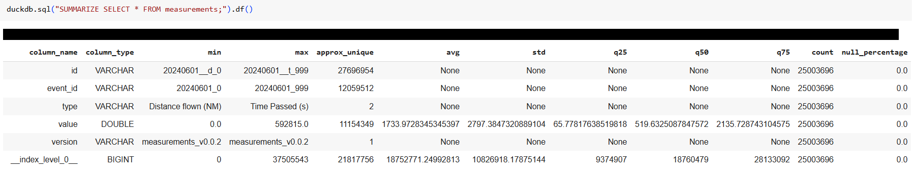

#### Data Cleaning
- Checked data types to ensure consistency in temporal and numerical fields
- Identified missing data, incomplete records
- Checked for duplicates

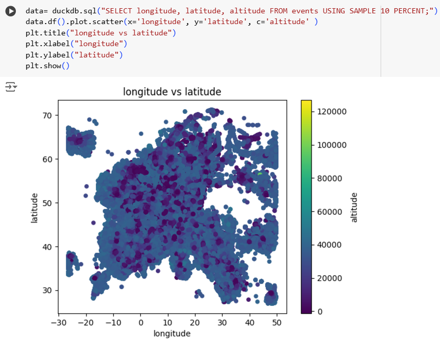

#### Visual Analysis
- Created plots and charts for visually exploring the data
- Created Geospatial visualizations to understand how the data could be used

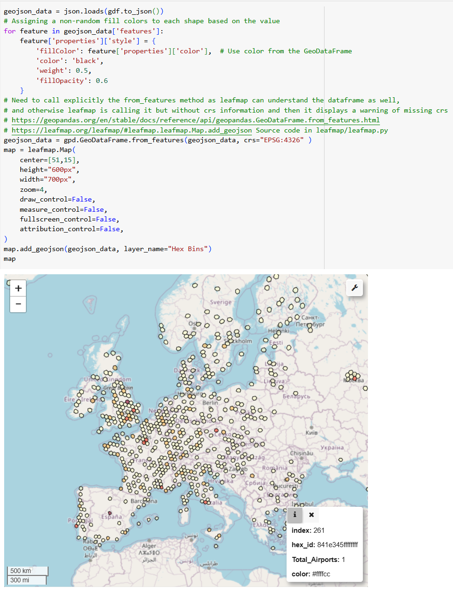

[Link to the Notebook](https://colab.research.google.com/drive/1IsFWsnMqP4pvMb2yWFjPfHHJ_kCYxP47?usp=sharing)

---
### Data Models
---

#### Conceptual Data Model

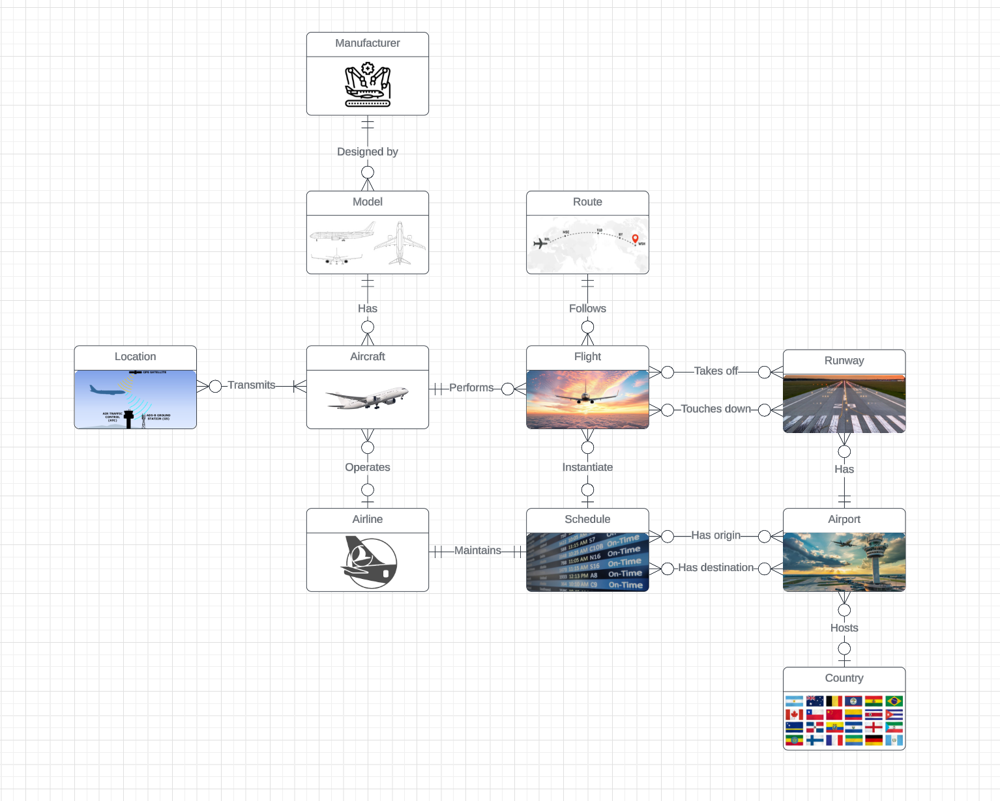

[Link](https://lucid.app/lucidchart/43e080e7-2bb1-4b75-b675-39dd35f028bb/edit?viewport_loc=851%2C153%2C1535%2C626%2C0_0&invitationId=inv_39afcf60-6186-434d-835e-ca2bcf9112d3)

#### Logical Data Model

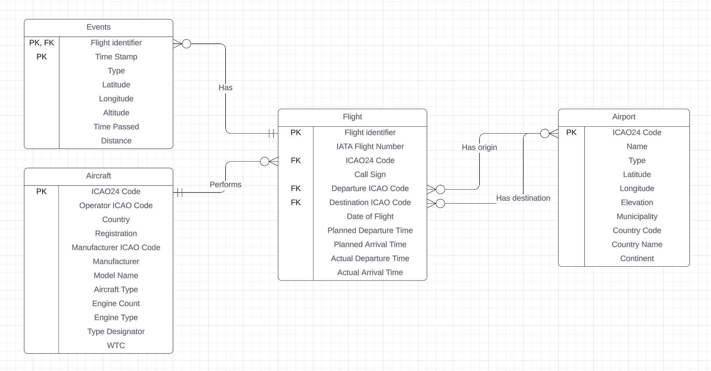

[Link](https://lucid.app/lucidchart/c255de4d-f613-4381-b961-141625ff38da/edit?viewport_loc=527%2C657%2C1705%2C780%2C0_0&invitationId=inv_cfdb4266-f7d1-47b0-b1e5-35893c7988fc)

#### Physical Data Model
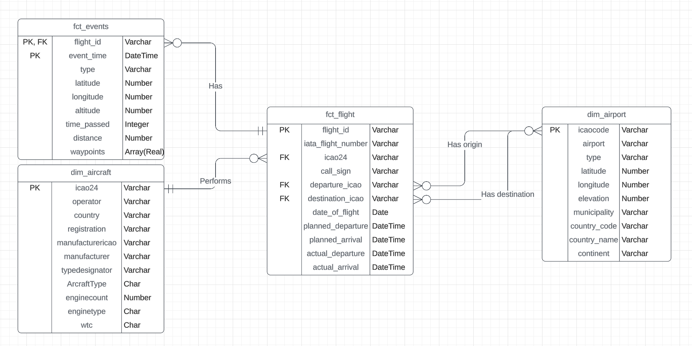

[Link](https://lucid.app/lucidchart/b515820a-61fd-445d-addc-7e89e08ea482/edit?viewport_loc=-188%2C257%2C1705%2C780%2C0_0&invitationId=inv_c8c78d4a-8932-43d4-97a8-449e0833be00)

#### Flow Diagram

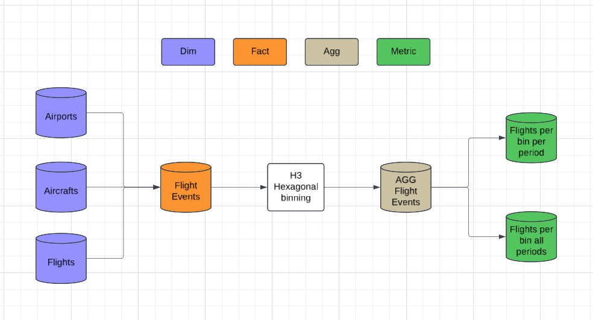

[Link](https://lucid.app/lucidchart/14b4d86f-0b99-4f8a-b43b-4868fb23f231/edit?viewport_loc=-302%2C-120%2C2300%2C1052%2C0_0&invitationId=inv_f98d9a41-9915-478e-88bf-3aa3cedc9df3)

---
### Data Dictionary
---
#### Flights
Purpose of the table
Source of the table
- OPDI Flights dataset

| Field            | Type     | Format | Size | Values | Description                                                                                                                                                    | Constraints |
| ---------------- | -------- | ------ | ---- | ------ | -------------------------------------------------------------------------------------------------------------------------------------------------------------- | ----------- |
| FlightID         | Varchar  |        |      |        | Unique ID                                                                                                                                                               | PK, Unique          |
| iataFlightNumber | Varchar  | AB123  | 5-6  |        | Primarily used in booking and ticketing, so passengers see the IATA code on their tickets and in airport displays.                                             |             |
| ICAO24           | Varchar  |        |      |        | [ICAO 24-bit address](https://en.wikipedia.org/wiki/Aviation_transponder_interrogation_modes#ICAO_24-bit_address), Mode S equipped aircraft are assigned this unique  address (informally Mode-S "hex code") upon national registration.  | FK          |
| CallSign         | Varchar  |        | 6    |        | An identifier used by pilots and air traffic control for communication and flight tracking.  Airlines tend to use their flight numbers as their call signs. |             |
| DepartureICAO    | Varchar  | A0F9   | 3-7  |        | ICAO24 code of the aerodrome of departure.                                                                                                                     |             |
| DestinationICAO  | Varchar  | A0F9   | 3-7  |        | ICAO24 code of the aerodrome of destination.                                                                                                                   |             |
| DOF              | Date     |        |      |        | Date of the flight.                                                                                                                                            |             |
| PlannedDeparture | DateTime |        |      |        | Planned time for departure.                                                                                                                                    |             |
| PlannedArrival   | DateTime |        |      |        | Planned time for arrival.                                                                                                                                      |             |
| ActualDeparture  | DateTime |        |      |        | Actual time for departure.                                                                                                                                     |             |
| ActualArrival    | DateTime |        |      |        | Actual time for arrival.                                                                                                                                       |             |

---
#### Aggregated Flight Counts

| Field        | Type     | Format | Size | Values | Description                                                         | Constraints |
| ------------ | -------- | ------ | ---- | ------ | ------------------------------------------------------------------- | ----------- |
| HEX          | Varchar  |        |      |        | The ID of the H3 hexagonal bin                                      | PK, Unique          |
| Year_start   | DateTime |        |      |        | The start of the year, the row contains data for                    | PK          |
| Metric_array | Array    |        |      |        | Array of the count of flights flying through the hexbin in a period. The period is every 10 days, and is based on the cadence of the flights event data source. |             |

---
#### Events
Source of the table
- OPDI Events dataset
- OPDI Measurements dataset

| Field      | Type     | Format     | Size | Values | Description                                                                                                                               | Constraints |
| ---------- | -------- | ---------- | ---- | ------ | ----------------------------------------------------------------------------------------------------------------------------------------- | ----------- |
| FlightID   | Varchar  |            |      |        | Unique ID of the flight                                                                                                                                         | PK          |
| TimeStamp  | DateTime |            |      |        | Time dimension.                                                                                                                           | PK          |
| Type       | Varchar  |            |      |        | The description of the event connected to the timestamp, e.g. take-off, touch-down, reaching specific altitude or part of the trajectory. |             |
| Latitude   | Float    | NN.NNNNNN  |      | +/-90  | Geographic coordinate specifying the north–south position of the location.                                                                |             |
| Longitude  | Float    | NNN.NNNNNN |      | +/-180 | Geographic coordinate specifying the east-west position of the location.                                                                  |             |
| Altitude   | Float    |            |      |        | Geographic coordinate specifying the distance from sealevel.                                                                              |             |
| TimePassed | Integer  |            |      |        | Time passed since first waypoint in seconds.                                                                                              |             |
| Distance   | Number   |            |      |        | Distance completed since first waypoint in nautical miles.                                                                                |             |
| Waypoints  | Array    |            |      |        | The list of 4D coordinates intrapolated from the previous event                                                                           |             |

---
#### Aircrafts
Source of the table
- [OSN Aircraft Database (Complete, 2024-10)](https://s3.opensky-network.org/data-samples/metadata/aircraft-database-complete-2024-10.csv)
- [OSN Aircraft Types dataset](https://s3.opensky-network.org/data-samples/metadata/doc8643AircraftTypes.csv)
- [OSN Aircraft Manufacturers dataset](https://data-samples.s3.amazonaws.com/metadata/doc8643Manufacturers.csv)

| Field            | Type         | Format | Size | Values                                                                                                                    | Description                                                                                                                                                                                                                              | Constraints |
| ---------------- | ------------ | ------ | ---- | ------------------------------------------------------------------------------------------------------------------------- | ---------------------------------------------------------------------------------------------------------------------------------------------------------------------------------------------------------------------------------------- | ----------- |
| ICAO24           | Varchar      |        | 4    | hex                                                                                                                       | [ICAO 24-bit address](https://en.wikipedia.org/wiki/Aviation_transponder_interrogation_modes#ICAO_24-bit_address), Mode S equipped aircraft are assigned this unique  address (informally Mode-S "hex code") upon national registration. | PK, Unique  |
| OperatorICAO     | Varchar      |        | 3    | alphanumeric                                                                                                              | The[ICAO airline designator](https://en.wikipedia.org/wiki/Airline_codes#ICAO_airline_designator) is a code assigned by the International Civil Aviation Organization (ICAO) to aircraft operating agencies.                             |             |
| Country          | Varchar      | AA     | 4-35 |                                                                                                                           | Country of registration.                                                                                                                                                                                                                 |             |
| Registration     | Varchar      | AZ-019 | 4-7  |                                                                                                                           | An [aircraft registration](https://en.wikipedia.org/wiki/Aircraft_registration) is a code unique to a single aircraft, required by international convention to be marked on the exterior of every civil aircraft.                    | Unique      |
| ManufacturerICAO | Varchar      |        | 2-27 |                                                                                                                           | The[ICAO uses](https://en.wikipedia.org/wiki/List_of_aircraft_manufacturers_by_ICAO_name) a naming convention for aircraft manufacturers in order to be specific when mentioning an aircraft manufacturer's name.                        |             |
| ManufacturerName | Varchar      |        |      |                                                                                                                           | The common name of aircraft manufacturers.                                                                                                                                                                                               |             |
| ModelName        | Varchar      |        |      |                                                                                                                           | The model of the aircraft.                                                                                                                                                                                                               |             |
| AircraftType     | Varchar      |        | 1    | L - Landplane S - Seaplane A - Amphibian G - Gyrocopter H - Helicopter T - Tiltrotor                       | Types of aircrafts.                                                                                                                                                                                                                      |             |
| EngineCount      | Integer      |        | 1    |                                                                                                                           | The number of engines on the aircraft.                                                                                                                                                                                                   |             |
| EngineType       | Varchar      |        |      | J - jet T - turboprop,turboshaft P - piston E - electric R - rocket                                           | [The power component of an aircraft propulsion system.](https://en.wikipedia.org/wiki/Aircraft_engine)                                                                                                                                   |             |
| TypeDesignator   | Varchar |        | 2-4  | hex                                                                                                                       | An [aircraft type designator](https://en.wikipedia.org/wiki/List_of_aircraft_type_designators) is a 2 to 4 character alphanumeric code designating every aircraft type/subtype.                                                          |             |
| WTC              | Varchar      |        | 1    | L - Light, <=7 t M - Medium, >7 t, <=136 t H - Heavy >136 t, except Super J - Super, specified in ICAO Doc 8643 | [Wake turbulence category](https://en.wikipedia.org/wiki/Wake_turbulence_category) is a category based on the disturbance in the atmosphere that forms behind an aircraft.                                                            |             |

---
#### Airports
Source of the table
- [OurAirports airport dataset](https://ourairports.com/data/)
- [OurAirports countries dataset](https://davidmegginson.github.io/ourairports-data/countries.csv)

| Field          | Type           | Format     | Size | Values | Description                                                                                                                                                   | Constraints |
| -------------- | -------------- | ---------- | ---- | ------ | ------------------------------------------------------------------------------------------------------------------------------------------------------------- | ----------- |
| ICAO24 (ident) | Varchar        | A0F9       | 3-7  |        | The [ICAO airport code](https://en.wikipedia.org/wiki/ICAO_airport_code) or location indicator is a four-letter code designating aerodromes around the world. | PK, Unique  |
| Name           | Varchar        |            |      |        | Name of the aerodrome.                                                                                                                                        |             |
| Type           | Varchar        |            |      |        | Type of the aerodrome.                                                                                                                                        |             |
| Latitude       | Float          | NN.NNNNNN  |      | +/-90  | Geographic coordinate specifying the north–south position of the location.                                                                                    |             |
| Longitude      | Float          | NNN.NNNNNN |      | +/-180 | Geographic coordinate specifying the east-west position of the location.                                                                                      |             |
| Elevation      | Signed Integer |            |      |        | The elevation of the location in feets.                                                                                                                       |             |
| Municipality   | Varchar        |            |      |        | The name of the area the aerodrome is located in.                                                                                                             |             |
| CountryCode    | Varchar        | AZ         | 2    |        | Internationally recognized [standard codes](https://en.wikipedia.org/wiki/List_of_ISO_3166_country_codes) of 2 letters that refer to countries.               |             |
| CountryName    | Varchar        |            |      |        | The name of the country the aerodrome is located in.                                                                                                          |             |
| Continent      | Varchar        | AZ         | 2    |        | The internationally recognized code of the continent the aerodrome is situated.                                                                               |             |

---
### Tech Stack
---

#### High Level Architecture

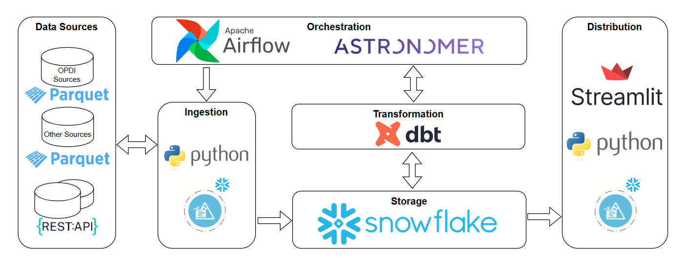
#### Snowflake
Centralized storage for all data, allowing performant querying and integration with other tools.
###### Why Snowflake?
- Highly scalable data warehouse that handles large datasets efficiently
- Supports Parquet and CSV file ingestion with custom file format definitions
- Has general availability of H3 functions within Snowflake's SQL scripting
#### Snowpark
Used for ingesting data into Snowflake
###### Why Snowpark?
- Provides an easy solution to ingest data into Snowflake
- Enables a wide range of operations to complement SQL
#### dbt
To define and orchestrate transformations on the raw data and create aggregations.
###### Why dbt?
- Simple to create and manage SQL-based transformations.
- Provides version control, documentation, and testing for data pipelines.
- Ensures modular and reusable transformation logic
#### Airflow
To Schedule and orchestrate ingestion, transformation, and analytics workflows.
###### Why Airflow?
- Airflow allows scheduling and managing workflows with clear dependencies between tasks.
- Can be used with dbt through Cosmos
#### Cosmos
Bridges Airflow orchestration with dbt's transformation logic, creating a unified ETL pipeline.
###### Why Cosmos?
- Integrates dbt with Airflow
- Executes dbt models as part of the Airflow pipeline
#### Streamlit
To build an interactive dashboard for visualizing data.
###### Why Streamlit?
- Simplifies sharing insights with stakeholders via a web-based interface
- Uses Python
- Built into Snowflake
#### DuckDB
To Conduct exploratory analysis and testing of queries before creating them in Snowflake.
###### Why DuckDB?
- Lightweight and fast for prototyping
- Ideal for quickly exploring and querying Parquet and CSV files without loading the data into a warehouse

---
### Pipeline
---
The pipeline uses modern data engineering practices to extract, clean, and model data using a Medallion architecture that includes Staging, Intermediate, and Datamart layers. 

##### Data sources
- Some of the data sources comprise of several parquet files broken down to an interval of either a month or 10 days
- Other sources are CSV files, updated at a daily or monthly cadence.
- All sources are available for download from different websites.
- At the moment there is no live API available to get the same complete dataset so I decided the consume the available sources in this project with a time delay, starting from the beginning of 2024

##### Extracting the Data
- The most efficient way I found to ingest the data was to upload to Snowflake's internal stage and copy into tables with Snowflake's Snowpark API
- I opted for this solution also because it will be easy to adjust when the dataset is migrated to an S3 bucket in the future

###### Tasks:
- Python script to get the different files for each time period
- Using the Snowpark API to upload the file to an internal stage within Snowflake
- Running a Snowflake query to copy the data from the stage into a newly created table
- A Python script to clean up temporary files
- Running a Snowflake query for basic Data Quality check
- If the checks pass, the next task deletes the file from the temporary stage
##### Transformation with dbt
The transformation process follows the Medallion Architecture:
###### 1. Staging Layer
- Data is ingested "as-is," retaining all fields and formats to ensure data traceability.
- Light transformations, type casting, renaming fields.
###### 2. Intermediate Layer 
- Perform data enrichment, cleaning, and transformations.
- Joining different datasets. 
###### 3. Datamart Layer
- Analysis-ready datasets for the dashboard.
- Creating aggregations and final metrics.

##### Data Quality Checks in dbt
All dbt models have some kind of testing included:
- Built in Generic Tests, e.g.:
	- unique
	- not_null
	- accepted_values
- Tests by dbt expectations, e.g.:
	- expect_column_values_to_be_between
	- expect_column_values_to_be_of_type

##### Documentation 
I used dbt's built in commands to generate documentation and create a static website with an overview of the models.

	dbt docs generate
	dbt docs serve

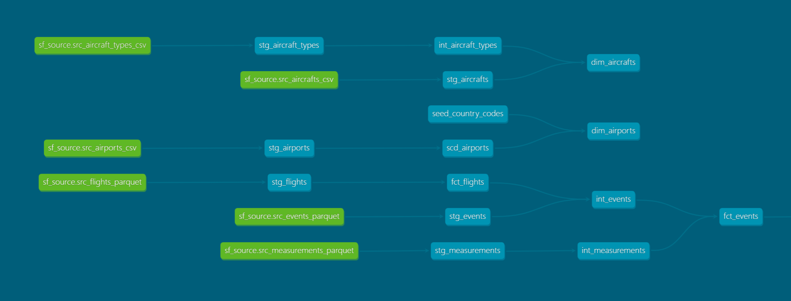

##### Orchestration by Airflow 
In the end I grouped the tasks into task groups and created two dags running at different frequencies. 

###### Important: There is an additional task at the beginning of each dag, that checks if the previous dag run was successful. This task needs to be marked as successful for the very first run of both dags.
###### Monthly Dag:
- Monthly Flights data
- Aircrafts data
- Aircraft types data

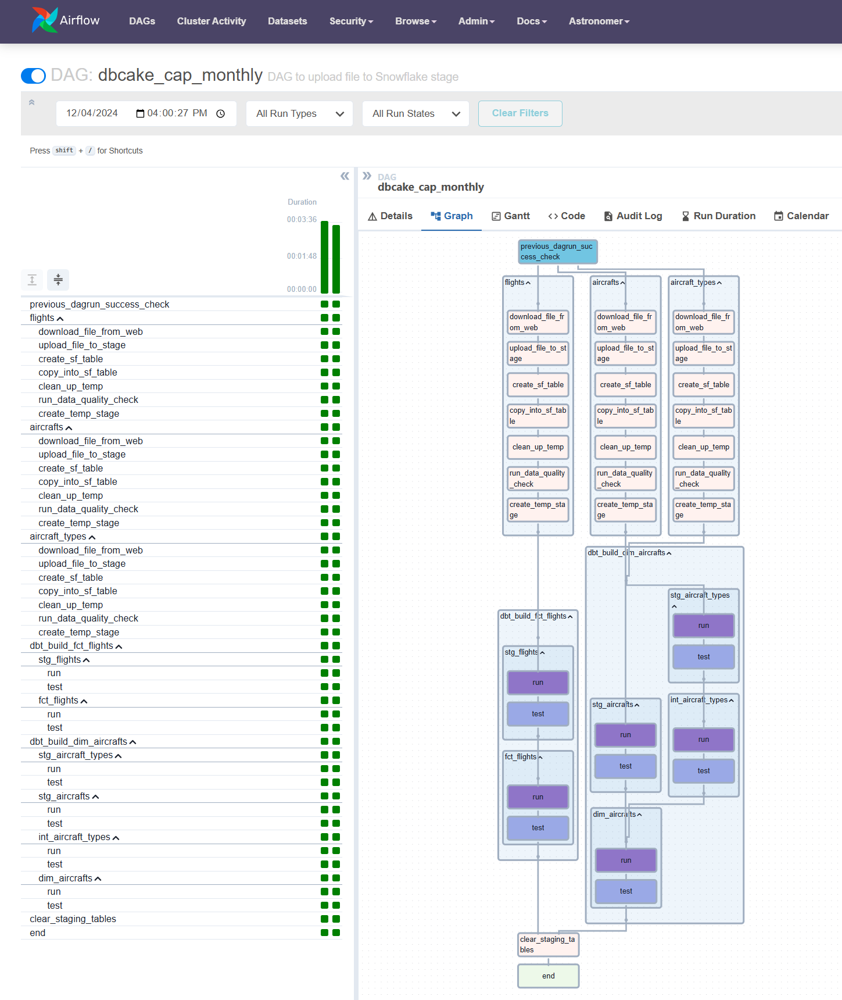

###### Weekly Dag:
- Flight Events data
- Flight Measurements data
- Airports data

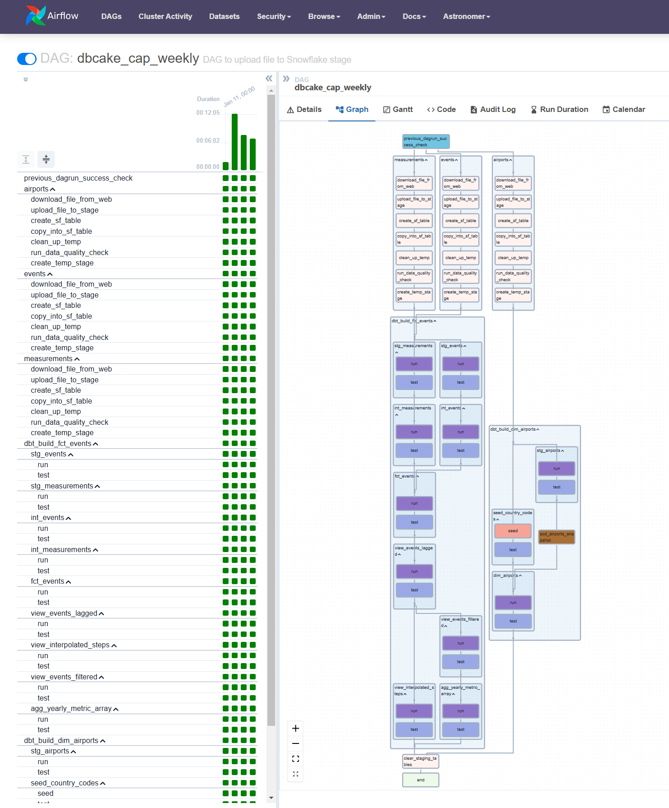

---
### Visualization
---
I used Streamlit within Snowflake to build an interactive web application and pydeck for geospatial visualization.
Link to the application is [here](https://app.snowflake.com/lywbbpj/odb66944/#/streamlit-apps/DATAEXPERT_STUDENT.DBCAKE.MLEY6DHY93REILXI?ref=snowsight_shared).

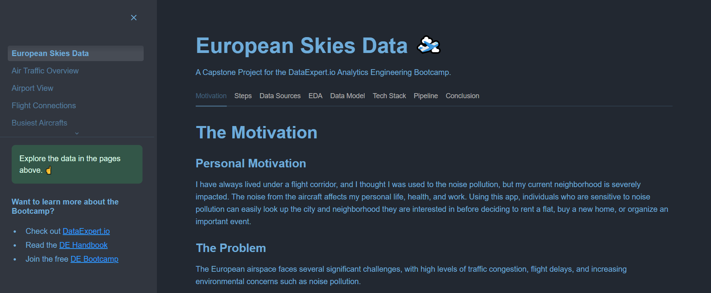

Main visualizations:
1. Air traffic heatmap for Europe based on H3 hexagonal bins (with a H3 resolution of 8)
   
   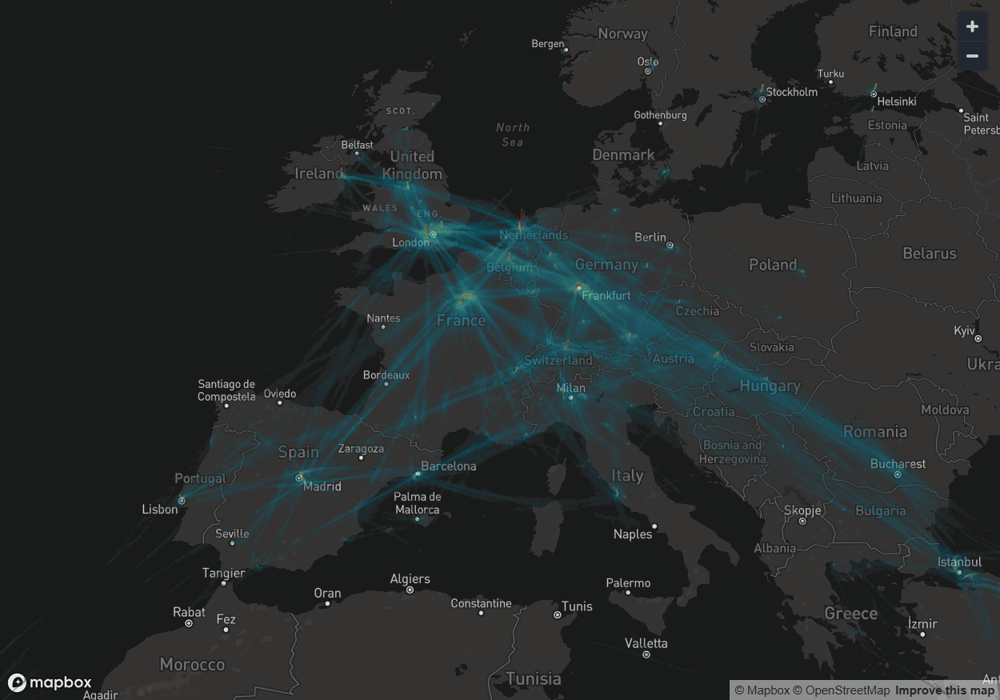

2. An airport heatmap for any airport in the continent, selected by the user after filtering on the country (resolution can be set by the user between 6 and 10)
   
   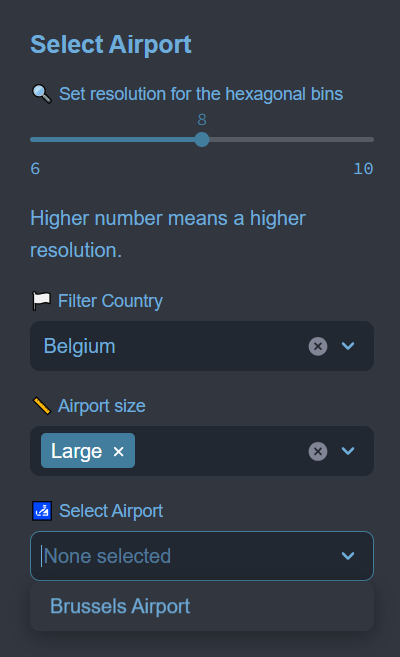
   
   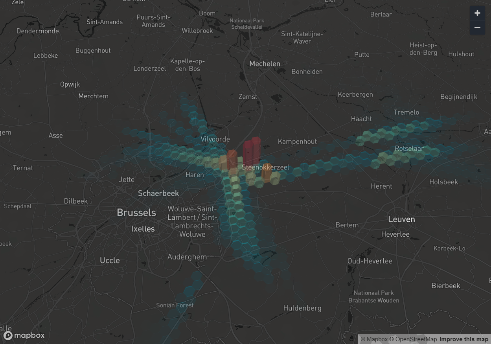

3. A map with the most frequently used connections between airports (using pydeck's GreatCircleLayer)
   
   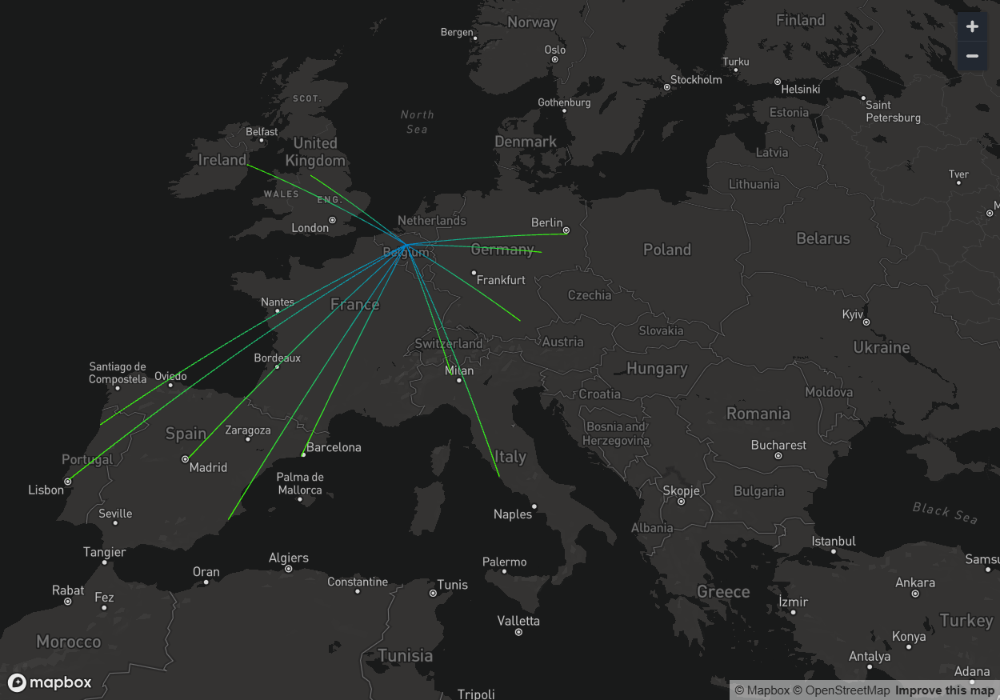

4. A map showing the path of the 10 aircrafts with the most flights (using pydeck's PathLayer)
   
   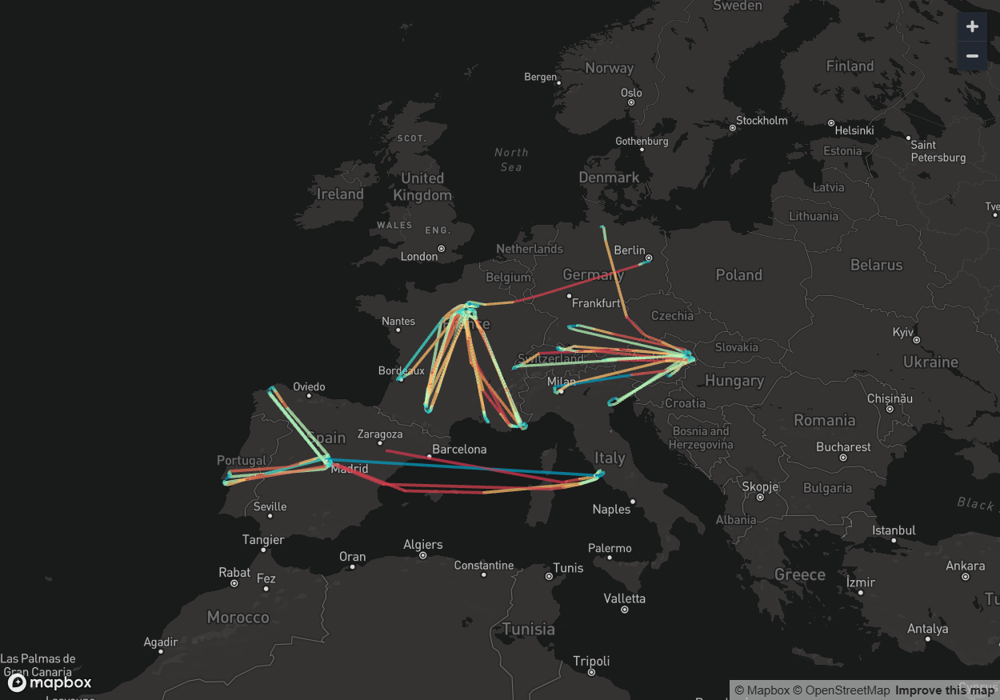

The visualizations were particularly challenging because not every tool is supported by Streamlit within Snowflake.

---
### Next Steps
---
There was only a limited time for the project, so there are still a lot of ideas for improvement and for new functionalities.
- The main data sets are currently only available in parquet files downloadable from a website, but hopefully it will be available through an Amazon S3 bucket in the near future
- There are plans for more frequent release of the data, which when integrated would offer a more up to date picture
- I wanted to integrate flight schedule data as well, to analyze flight delays
- Compare schedule data with weather data from the Open-Meteo API to discover the effects of weather on flight delays
- Currently the dataset is limited to the start of the year to be mindful of the costs associated but the time scope can be extended easily
- Create similar visualization within Tableau or PowerBI

---
### Conclusion
---
This capstone project for the Analytics Engineering Bootcamp was a challenging experience, but I learned a lot.
I had to design and implement a complex data pipeline, integrating several data sources and utilizing various modern data engineering tools.

The main highlights for me working on the project:
- Used some data sets with many millions of rows each
- Doing EDA in **Google Colab** with **DuckDB**
- Included a **reduced fact table** in the data model using complex data structure in the row
- Adding specific data formats for the different CSV versions I imported in Snowflake
- Creating Snowflake **Python User Defined Functions** for some special use cases
- Using **Astronomer's Cosmos** to integrate dbt tasks into **Airflow**
- Leveraging Uber's **H3** Hexagonal hierarchical geospatial indexing system for aggregating data
- Using **Geospatial visualization** tools and libraries, such as **Leafmap and pydeck**
- Building a **Streamlit** App for interactive visualization

In this project I tried to implement various methods and technologies we learned in the Bootcamp. Through designing and implementing this complex data pipeline I gained valuable experience, improved technical proficiency and problem solving skills.

---
